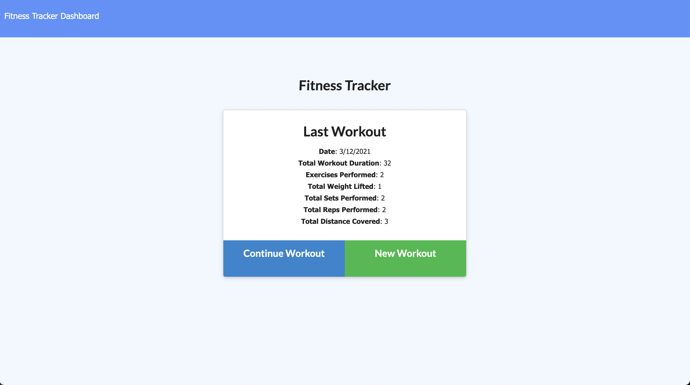
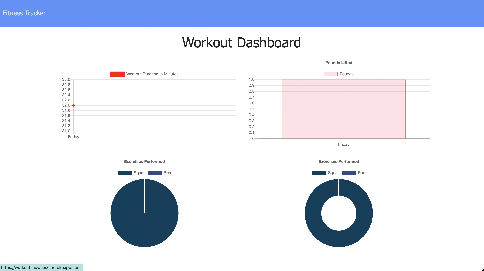

# Unit 17 NoSQL Homework: Workout Tracker

This application was created to allow users to track their workouts and view their stats, including sets, reps, and duration. The workouts are separated by cardio and resistance for simple logging. 

## Deployed Application  

[Click here to access the application on Heroku](https://workoutshowcase.herokuapp.com/?id=6056bdf682691b0015217956) 

## Demo

[Click here to view the Demo Video](https://drive.google.com/file/d/1s2ZpravDsxEPmg4Z4jkHLmPOKP59MWwi/view)

## Specifications For This Applciation

* This application uses MongoDB for the database

To try this applicaiton on your own:

* click on the heroku link above
* fork this repo
`npm install`
`npm node server.js`
* Set up MongoDB Atlas
* Then deploy the application with MongoDB database with Heroku
